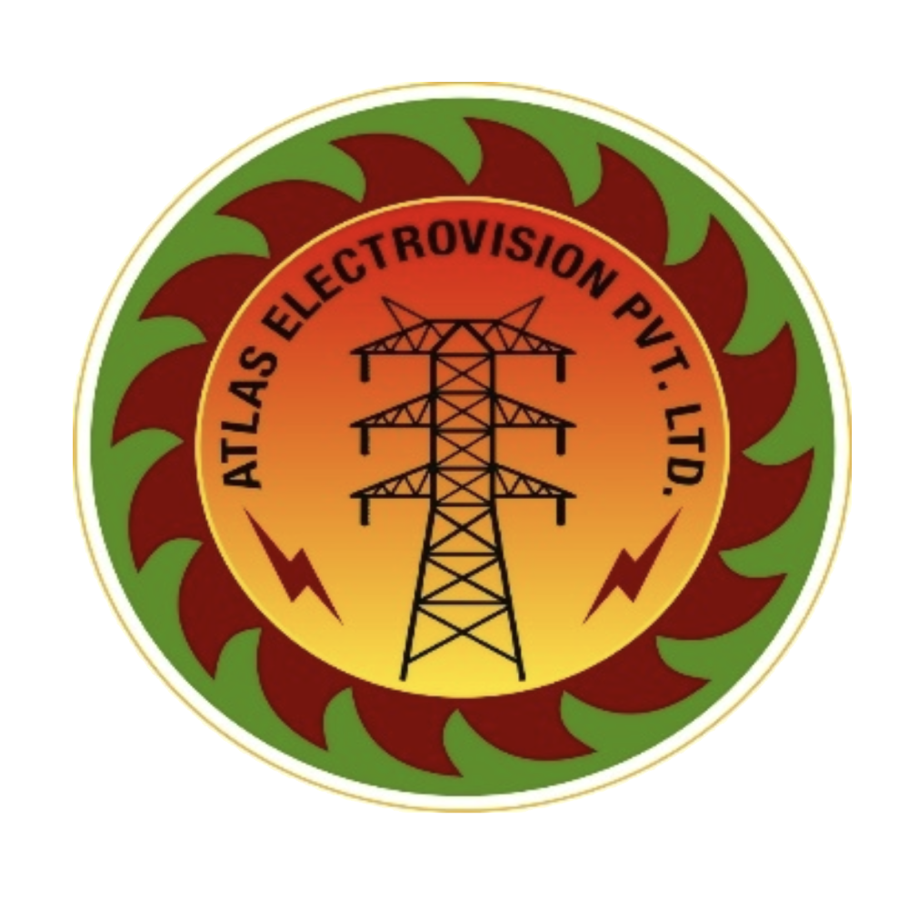

<!--  -->

  

# Welcome to Atlas Electro Vision

For nearly three decades, Atlas Electro Vision Pvt. Ltd. (AEVPL) has been a cornerstone of electrical excellence in India. As an ISO 9001:2008 certified company, we deliver premium electrical maintenance and testing services that power industries forward.

Our comprehensive service portfolio includes:
- Transformer testing and maintenance
- Energy audits and management solutions
- Solar PV EPC projects
- Advanced electrical troubleshooting
- Power factor correction and improvement

What sets us apart is our team of highly qualified engineers equipped with state-of-the-art testing facilities. From industrial sectors to real estate projects, we provide tailored electrical solutions that help our clients focus on what matters most – their core business.

Choose AEVPL for reliability, expertise, and unwavering commitment to quality. Let us electrify your success story.

*Licensed by M.P. Licensing Board* \| *Serving India since 1994*